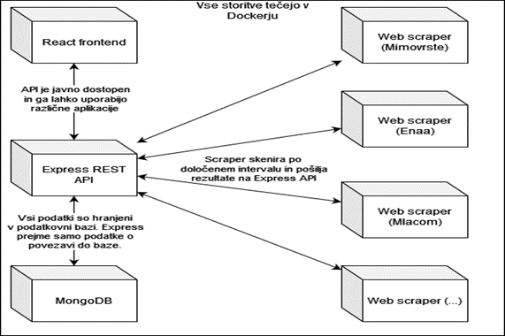

# RPS-Projekt

Aplikacija katera brska po spletnih straneh  kot so npr. Mimovrste, Bigbang itd., jih spremlja in shranjuje podatke o cenah izdelkov. Cene izdelkov in njihove izdelke prikazujemo na spletni strani, kjer si je mogoče ogledati celotno zgodovino cen.

